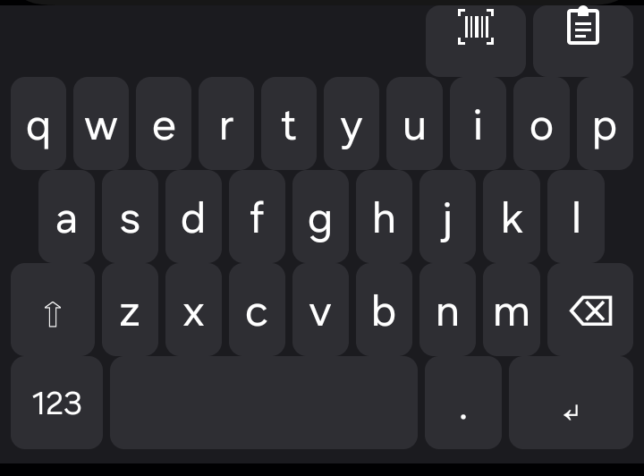
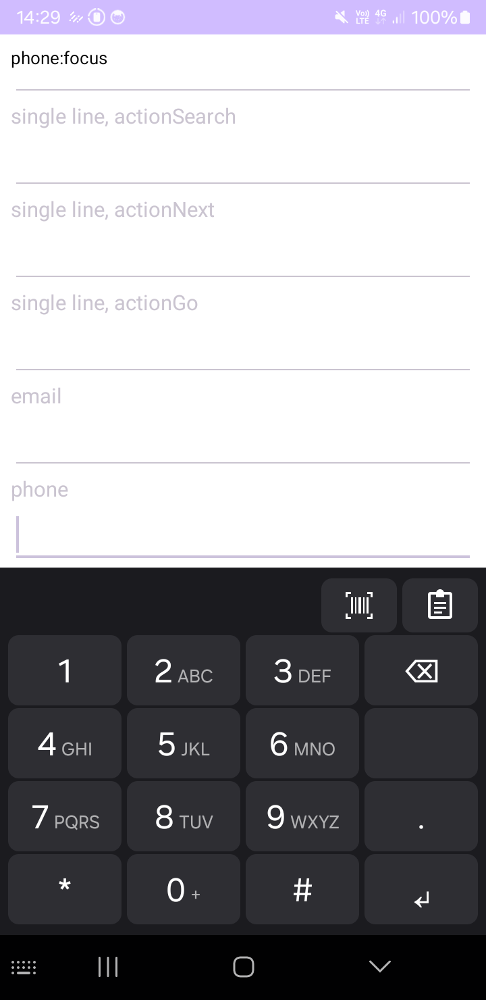
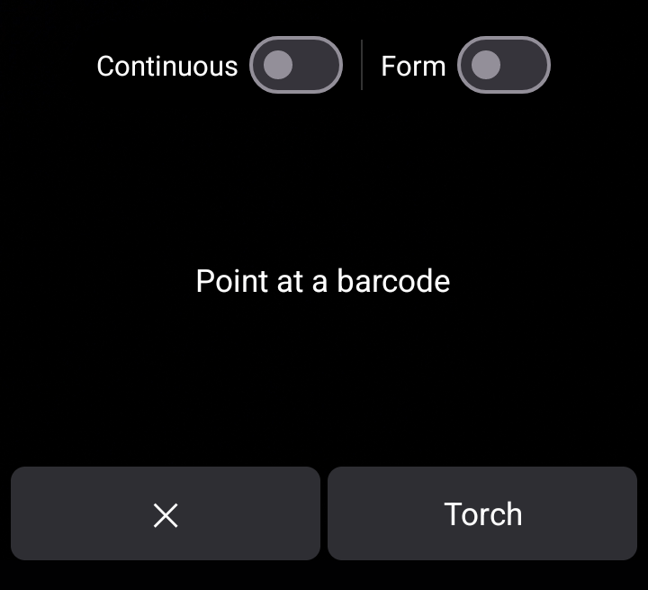
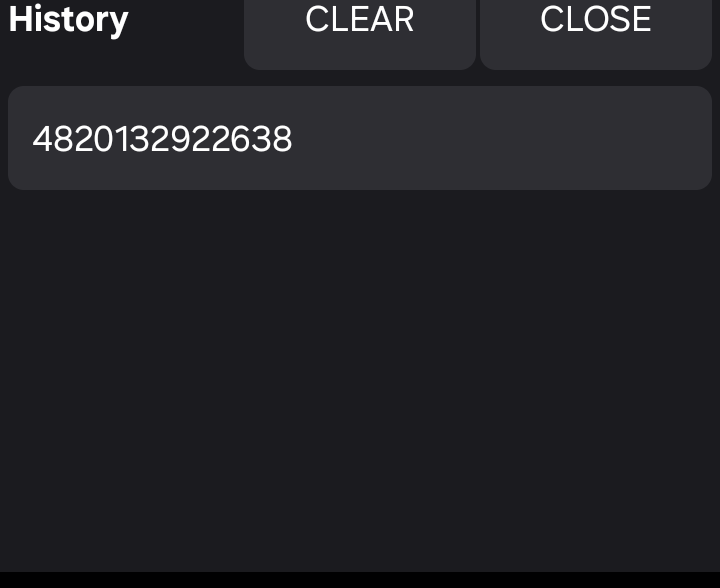

# Scanner Keyboard

An open-source Android keyboard (IME) with a built-in, fully offline barcode
and QR code scanner (Apache-2.0 — see [License](#license)). Tap the scan key
and the keyboard swaps to a live camera viewfinder. When a code is detected,
the decoded text is inserted at the cursor of the field you are typing in.
The phone buzzes, and the scanner closes back to the keyboard.


Built with Kotlin, the XML View system, CameraX, and ML Kit barcode scanning
(bundled model). Package: `org.ubaierbhat.android.barcodekeyboard`.

## Screens

| Keyboard | Phone dialpad | Scanner | History panel |
|:---:|:---:|:---:|:---:|
|  |  |  |  |

## Privacy

Scanning is 100% on-device:

- The app declares **no `INTERNET` permission**, so it cannot make network
  calls at any point. The Android platform enforces this, not just convention.
- Barcode/QR decoding runs entirely on your phone using ML Kit's bundled
  model. No images or decoded values are ever uploaded or logged.
- The camera is open only while the scanner view is on screen. It is released
  as soon as the scanner closes, the keyboard hides, or the app is switched
  away from.
- Scan history and clipboard captures are stored only in the app's private storage on
  your device.

## Features

- **Keyboard** — full QWERTY with shift (tap for one-shot, long-press for caps
  lock), a numbers layer, and a second `#+=` symbols layer. Smart Enter
  performs the field's Search/Go/Send/Done editor action when present; in
  multiline fields it inserts a newline. Long-press backspace auto-repeats,
  and key presses buzz.
- **Barcode scanner** — real-time camera viewfinder inside the keyboard window.
  Detects QR, EAN-8/13, UPC-A, Code 39/93/128, ITF, Codabar, PDF417, Aztec, and
  Data Matrix. Auto-inserts the decoded text, buzzes, and closes. Includes a torch
  toggle for dark environments.
- **Continuous scan** — a switch in the scanner preview keeps the camera rolling
  and inserts every new code. Consecutive duplicate scans are ignored, and the
  setting is remembered.
- **Scan actions** — opt-in on the setup screen: newline and tab characters in
  scanned data become Enter (the field's editor action, or a real newline in
  multiline fields) and Tab focus moves, so multi-field forms can be filled with
  a single scan.
- **Accents** — long-press any supported letter (a, c, d, e, g, h, i, j, l, n, o,
  r, s, t, u, y, z) to pop up its accented variants. Slide to one and release
  to insert it (uppercase when shift/caps is active).
- **History** — the last 20 scanned and copied texts (newest first, deduplicated).
  While Scanner Keyboard is your default keyboard, copied text is picked up
  into history the next time the keyboard opens. Tap a history entry to
  re-insert it at the cursor. Clearable with one tap.
- **Function toolbar** — a row above the keys with the scanner, history, and
  settings keys. The settings key jumps straight to the app's setup screen.
- **Setup wizard** — first-run screen with live status for camera permission and
  keyboard enablement.

## Setup

1. Install the app (see [Build](#build) for the debug APK, or sideload an APK file).
2. Open **Scanner Keyboard** from your app drawer. The setup screen shows two steps
   with live status chips:
   - **Allow camera access** — tap *Grant camera permission* and accept the system
     dialog.
   - **Enable the keyboard** — tap *Open keyboard settings*, turn on **Scanner
     Keyboard** in the input methods list (confirm any popup warning).
3. When both chips read *Granted* / *Enabled*, the screen shows **Scanner Keyboard
   ready**.
4. Select it as your active keyboard. Tap any text field to bring up the
   current keyboard. Open the input-method picker: the small keyboard/globe
   icon in the navigation bar, or the "Choose input method" notification.
   Choose **Scanner Keyboard** in the list.

No account, no network, no configuration — you're done.

## Usage

- **Typing** — standard QWERTY. `123` switches to numbers/punctuation, `#+=` to
  more symbols, and `ABC` returns to letters. `#+=` carries `( ) { } [ ]` `` ` ``
  `^ _ €` for code and markdown, so you can write code blocks.
  Long-press `-` for `_`, or `$` for `€ £ ¥`. Phone and number fields
  automatically get a Samsung-style dialpad instead of the letter grid.
- **Shift / caps** — tap ⇧ to capitalize the next letter. Long-press ⇧ to lock
  caps (the key stays lit). Tap again to unlock.
- **Accents** — press and hold a letter, slide to a variant in the popup strip, and
  release to insert it. Release back over the original key to type the plain letter,
  or outside the strip to cancel.
- **Scanning** — tap the scan icon in the toolbar (top-left row). Point the
  back camera at a code. The live preview shows what the camera sees, so aim
  to fit the code in the frame. Tap **Torch** to fire the LED
  in low light. On detection the code text is inserted and the view closes. Tap ✕ to
  close without scanning. If camera access was revoked, the scan key shows an
  inline prompt with an *Open setup* button.
- **History** — tap the clipboard icon in the toolbar to browse recent scans and copies. Tap an entry to
  insert it (the panel closes). CLEAR empties the list; CLOSE returns to the
  keyboard.
- **Settings** — tap the gear icon (toolbar, left corner) to open the app's setup
  screen. The keyboard closes. Pressing Back returns you to the text field you
  were typing in, with your place kept.

## Build

Requirements: JDK 17 and an Android SDK (minSdk 24, compileSdk 36). Point
`local.properties` (`sdk.dir=...`) or `ANDROID_HOME` at your SDK. The app
builds with JDK 17. The unit-test tasks fork a separate JDK 21 JVM (Robolectric
needs it for the API 36 sandbox). Gradle provisions that JDK automatically
through the foojay resolver.

```bash
./gradlew assembleDebug        # APK: app/build/outputs/apk/debug/app-debug.apk
./gradlew test                 # JVM unit tests (Robolectric)
./gradlew installDebug         # build + install on a connected device/emulator
```

The Pages workflow publishes only this site. It has no Android CI job. Unit tests
run on your machine. Run `./gradlew test` before you push.

If you use the [Android CLI](https://developer.android.com/studio), `android run`
also deploys the app to a connected device. Gradle is the only hard requirement.

After installing, re-enable/re-select the keyboard in system settings (Android may
reset the active IME on reinstall).

## Limitations and roadmap

v1 is deliberately minimal. Not included (planned roadmap items):

- No autocorrect, glide/swipe typing, or swipe gestures.
- No theme/keyboard customization (single dark-ish static look).
- No split or one-hand mode.
- Single layout/subtype: English QWERTY with long-press accents (no per-language
  keyboard layouts).
- No per-app keyboard profiles.

Rotation while the scanner is open closes the camera and lands you back on the
keyboard. This is intentional: no camera ever stays open "by surprise".

## Project layout

```
app/src/main/     the IME: keyboard views, scanner, history, setup screens
app/src/test/     JVM unit tests (Robolectric)
app/src/debug/    debug-only field tester used for on-device QA
docs/             architecture.html, images/, acceptance/, play/, store/
public/           GitHub Pages site: index.html, privacy.html, licenses.html
tools/            icon generator scripts
.github/          Pages workflow, issue template, PR template
```

## Documentation

- Architecture: [docs/architecture.html](docs/architecture.html)
- Security assessment (MASVS v2.1): [docs/security/masvs-compliance.md](docs/security/masvs-compliance.md)
- Privacy policy: <https://ubaierbhat.github.io/scanner-keyboard/privacy.html>
- Third-party licenses: <https://ubaierbhat.github.io/scanner-keyboard/licenses.html>

## Community

- [CONTRIBUTING.md](CONTRIBUTING.md) — development setup and project rules
- [SECURITY.md](SECURITY.md) — threat model and vulnerability reporting
- [CHANGELOG.md](CHANGELOG.md) — release history

## License

Copyright 2026 Ubaier Bhat.

Licensed under the Apache License, Version 2.0 (the "License"); you may not use
this file except in compliance with the License. You may obtain a copy of the
License at <http://www.apache.org/licenses/LICENSE-2.0>.

Unless required by applicable law or agreed to in writing, software distributed
under the License is distributed on an "AS IS" BASIS, WITHOUT WARRANTIES OR
CONDITIONS OF ANY KIND, either express or implied. See the License for the
specific language governing permissions and limitations under the License.

Bundled third-party components and their licenses:

- ML Kit Barcode Scanning (bundled): Google, Apache-2.0 — see its project terms.
- CameraX, androidx.*, Material Components: Google, Apache-2.0.

The full generated list: [third-party license page](https://ubaierbhat.github.io/scanner-keyboard/licenses.html).
